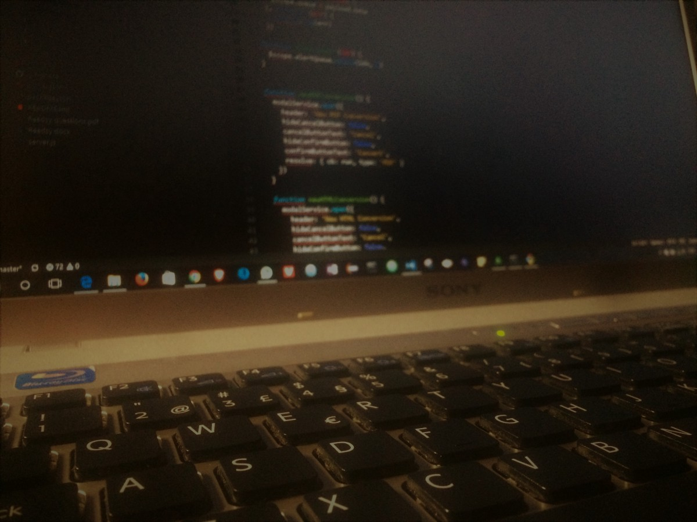

Six months ago I was a professional EMT with a full contract with no term, vacations and health insurance, no worries, just add to do my job, that I enjoy. Then in October of 2016, I made the jump to the tech industry, got a contract for a year with a company that I didn’t know anything about and had no idea what to expect!

Six months later, here I am! In the tech world, what a change! But I am enjoying it.

Rewind a little bit, during the time I was working as an EMT, and I was able to take my bachelor in computer science because I always had that curiosity about tech and the computer science engineering was my dream. It took me more time than the usual and sometimes all I want was to quit and enjoy the stable life that I had.

Nevertheless, I had an amazing person at my side that keep me motivated, and I manage to finish the degree.
In the last semester, I started to shot Curriculum's in every direction because all I want was to change this new adventure.

Got some answers and some interviews and finally get an agreement with my current company to start working as soon as my contract as an EMT finish. It was awesome, and I was super excited! Finally, after all the effort I got the chance that I was looking so much!

### October 2016: the start of a new career

At the beginning of this new adventure I was super excited and motivated to start working and learn new things, but at the same time, I was afraid of failing or don’t know how to solve problems and to be a fraud!
I can say that the first 2 to 3 months I was kind of lost, trying to understand some basic concepts, the company, how the things fit and so on.

From the third to the sixth month it was desperation because it seems that the work I was doing does not evolve and some days I was stuck with one issue and didn’t manage to get it solve, it was to pull out hair!

How did I manage to surpass this? Well, I guess that reading a lot helped! I read everything that I can get hands on, things like “how to work on someone’s code”, “how to understand the workflow of code”, “how to be a better web developer”. Everything that could help me reach somewhere or solve some problem was good!

Another excellent support, are the programming curriculum that we can find, it helps a lot, for instance, [FreeCodeCamp](https://www.freecodecamp.org) is one of them, where I did learn new things and keep going at my pace doing my curriculum path.

In the programming part, I start to register in [StackOverflow](https://stackoverflow.com/), and ask some questions on the issues that I had and try to search for the errors that I get in code.

I can also say that had days that I didn’t want to deal with the problem that I had to face, that was another days that the things seem to flow and get that good feeling at the end! And that was a good feeling!

So my trick was, now that I can get the full picture, don’t look at the problem or this new job as a horrible monster, try to break things into smaller problems/issues and focus on how to solve that little problem.

> try to break things into smaller problems and focus on how to solve that little problem

I know that sounds easy, but believe me, I have been there, and the best thing was to abstract from everything else and focus on that small problem. You don’t know that framework, try to know it at your spare time, see examples, tutorials, don’t know how to solve that code bug, google it, debug your code, try to know from where it came. Don’t understand someone else code, create a [new branch](https://github.com) (so you don’t mess up)and start diving into it, break it, see what happen if you change a few things. Then when you realize, you start to understand what are you doing and the work is flowing!

Another great motivation is to know people, and the more you know and understand that some of them don’t come with a computer related degree is incredible because they do whatever is possible to be good at it, so another motivation to keep pushing and work hard.

I don’t know what the future holds me, but I know that I want to be part of this amazing new world that I landed six months ago. I want to improve each day and do my job better because I know that six months is nothing and there is still a lot to learn and to grow!

Thank you for your time reading my first article and any help/tips or comments are always welcome 😁
