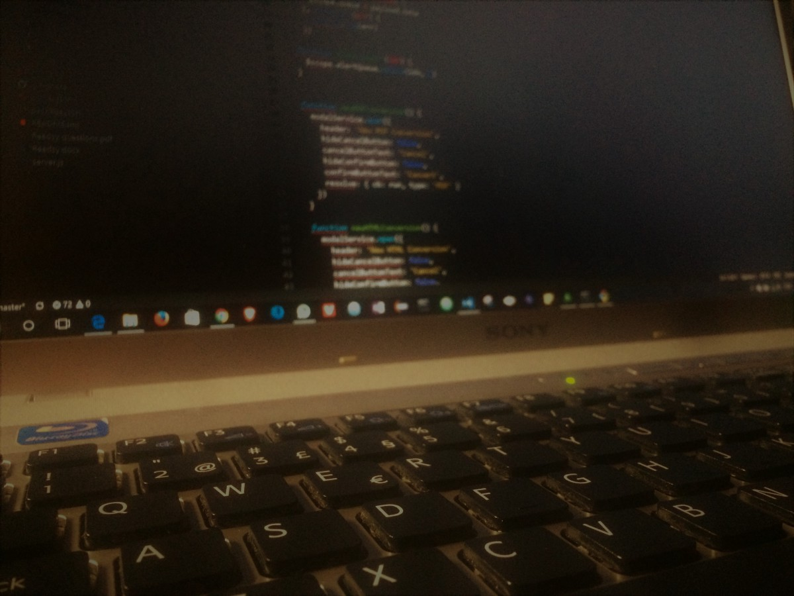

Six months ago, I was a professional EMT with a full contract with no terms, vacations, or health insurance, no worries, I just had to do my job, which I enjoy. Then, in October of 2016, I jumped into the tech industry and got a contract for a year with a company that I didn't know anything about and had no idea what to expect!

Six months later, here I am! In the tech world, what a change! But I am enjoying it.

Rewind a bit: while working as an EMT, I took my bachelor's in computer science because I always had that curiosity about tech, and computer science engineering was my dream. It took me more time than usual, and sometimes, all I wanted was to quit and enjoy my stable life.

Nevertheless, a fantastic person motivated me, and I managed to finish the degree.
In the last semester, I started to shoot Curriculum in every direction because I wanted to change this new adventure.

Got some answers and some interviews and finally reached an agreement with my current company to start working as soon as my contract as an EMT finishes. It was excellent, and I was super excited! Finally, after all the effort, I got the chance that I was looking so much!

### October 2016: the start of a new career

I was excited and motivated to start working and learning new things at the beginning of this new adventure. Still, at the same time, I was afraid of failing, not knowing how to solve problems, and being a fraud!
In the first 2 to 3 months, I was lost, trying to understand some basic concepts, the company, how things fit, and so on.

From the third to the sixth month, it was desperation because it seemed that the work I was doing did not evolve, and some days, I was stuck with one issue and didn't manage to get it solved; it was pulling out hair!

How did I manage to surpass this? Well, reading a lot helped! I read everything that I can get hands-on, things like "how to work on someone's code," "how to understand the workflow of code," and "how to be a better web developer." Everything that could help me reach somewhere or solve some problem was good!

Another excellent support is the programming curriculum that we can find; it helps a lot; for instance, [FreeCodeCamp](https://www.freecodecamp.org) is one of them, where I learn new things and keep going at my pace doing my curriculum path.

In the programming part, I started to register in [StackOverflow](https://stackoverflow.com/), asked some questions about my issues, and tried to search for the errors I got in the code.

I also had days when I didn't want to deal with the problem I had to face; that was another day when things seemed to flow, and I got that good feeling at the end! And that was a good feeling!

My trick was, now that I can get the whole picture, don't look at the problem or this new job as a horrible monster; try to break things into more minor problems/issues and focus on how to solve that little problem.

> Try to break things into more minor problems and focus on how to solve that little problem

I know that sounds easy, but believe me, I have been there, and the best thing was to abstract from everything else and focus on that minor problem. If you need to learn that framework, try to understand it in your spare time. See examples and tutorials. If you don't know how to solve that code bug, google it, debug your code, and try to learn from where it came. If you need help understanding someone else code, create a [new branch](https://github.com) (so you don't mess up)and start diving into it, break it, and see what happens if you change a few things. Then, when you realize this, you begin to understand what you are doing and the workflows!

Another great motivation is to know people, and the more you know and understand that some of them don't come with a computer-related degree, it is incredible because they do whatever is possible to be good at it, so another motivation to keep pushing and work hard.

I don't know what the future holds for me, but I want to be part of this fantastic new world I landed six months ago. I want to improve each day and do my job better because I know that six months is nothing and there is still much to learn and grow!

Thank you for your time reading my first article, and any help/tips or comments are always welcome 😁
