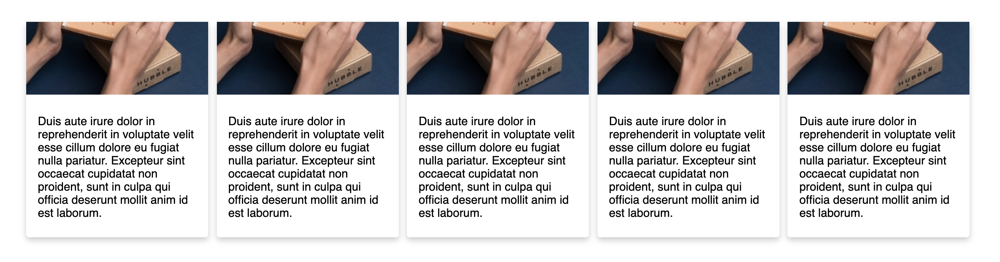
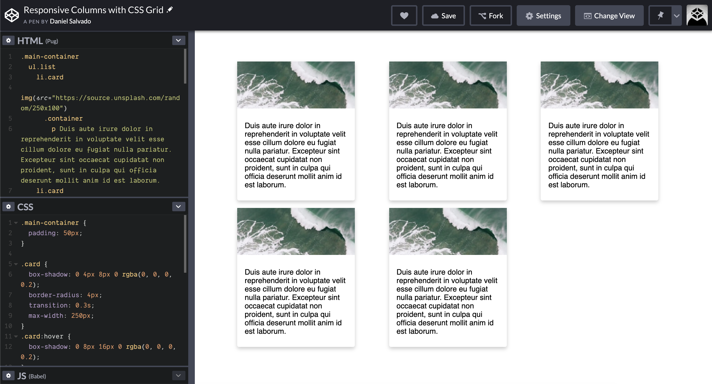

Recently I came across with a UI challenge, I wanted to have a group of elements that display in a row, that row should also be dynamic. I mean, the row should have as many elements possible and be responsive. It should create a row if the elements don’t fit on the first one.

What is the first thing that come to your mind? Flexbox right?

One thing I would like is to have the same amount of space between the elements without worrying about defining the space for each element.

So it’s here that CSS Grid comes into play! With `grid-gap` property, one could just define the amount of space that wants between elements.

```css{5}
.list {
    list-style: none;
    display: grid;
    grid-template-columns: repeat(auto-fill, minmax(250px, 1fr));
    grid-gap: 16px 8px; /* row gap, column gap */
}
```

I’ve put up a CodePen so it would be more visual. Click on the image below to open the CodePen. 👇

[](https://codepen.io/danisal/pen/XvJBEd)

For this example, I’ve just used some cards with random images and some text.

What do we have in this CodePen? Let's break the CSS.

First, I just have a list of elements, could be anything and is here that I define that this element will be displayed as a grid.

```css{3}
.list {
    list-style: none;
    display: grid;
    grid-template-columns: repeat(auto-fill, minmax(250px, 1fr));
    grid-gap: 16px 8px; /* row gap, column gap */
}
```

The children elements will be placed according to this definition:

```css
grid-template-columns: repeat(auto-fill, minmax(250px, 1fr));
```

They will be placed in columns but taking space into account. The `repeat` function takes as first argument the number of times I want to repeat the elements, the columns, in this case. The sub-sequential arguments are the widths for each element, that is this case, is another function, `minmax()`.

Let’s focus for now in the first argument, I'll get to the `minmax` function in a second. The `auto-fill` expression tells the grid to fit the maximum number of elements in one row without causing an overflow of the grid container. There are other values that can be given, check the MDN for more information [about the repeat function.](https://developer.mozilla.org/en-US/docs/Web/CSS/repeat)

For the `minmax` function, I think is easier to understand, in here I’m telling the function that the minimum width for an element is `250px` and the maximum value is one fraction of the available space `1fr`, this way it will fit as many elements as possible in a single row.

As soon as the screen shrinks or the viewport changes, then the grid takes care of organizing itself in a way that if the last element of the column no longer fits in that column, will be placed on the next one!

And this is the beauty of CSS Grid, with such few lines of code, I have my element doing all the work without worrying about the number of elements that will come from the API, for example.
